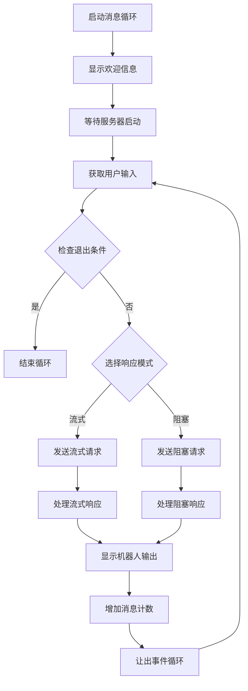
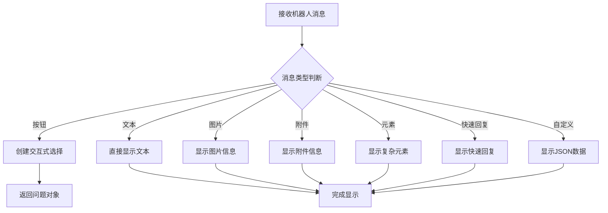
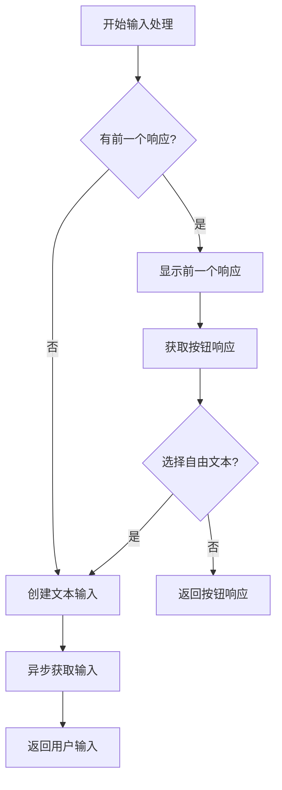
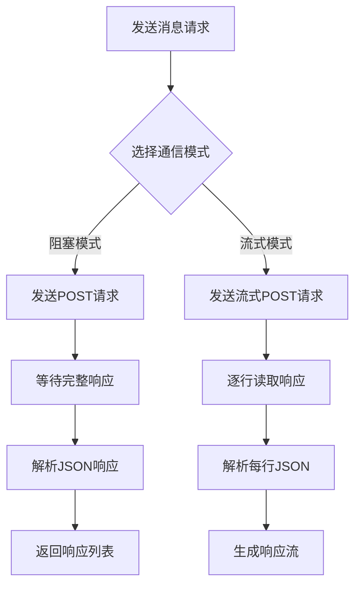

# Rasa Console Channel 核心功能分析

## 概述

`console.py` 是 Rasa 框架中实现命令行交互通道的核心模块。该模块提供了在命令行环境中与 Rasa 机器人进行交互的功能，支持多种消息类型（文本、按钮、图片、附件等）的显示和用户输入处理，是 Rasa 开发和测试的重要工具。

## 核心架构

### 1. 消息显示系统

#### print_buttons 函数
```python
def print_buttons(
    message: Dict[Text, Any],
    is_latest_message: bool = False,
    color: Text = rasa.shared.utils.io.bcolors.OKBLUE,
) -> Optional[questionary.Question]:
    """从消息数据创建CLI按钮。"""
```

**功能特点：**
- 支持交互式按钮选择
- 支持自由文本输入
- 可配置显示颜色
- 返回交互式问题对象

**实现逻辑：**
```python
if is_latest_message:
    # 创建交互式选择问题
    choices = cli_utils.button_choices_from_message_data(
        message, allow_free_text_input=True
    )
    question = questionary.select(
        message.get("text"),
        choices,
        style=Style([("qmark", "#6d91d3"), ("", "#6d91d3"), ("answer", "#b373d6")]),
    )
    return question
else:
    # 直接打印按钮列表
    rasa.shared.utils.cli.print_color("Buttons:", color=color)
    for idx, button in enumerate(message.get("buttons")):
        rasa.shared.utils.cli.print_color(
            cli_utils.button_to_string(button, idx), color=color
        )
    return None
```

#### _print_bot_output 函数
```python
def _print_bot_output(
    message: Dict[Text, Any],
    is_latest_message: bool = False,
    color: Text = rasa.shared.utils.io.bcolors.OKBLUE,
) -> Optional[questionary.Question]:
    """打印机器人输出消息。"""
```

**支持的消息类型：**
- **文本消息**: 直接显示文本内容
- **按钮消息**: 显示可选择的按钮
- **图片消息**: 显示图片路径或URL
- **附件消息**: 显示附件信息
- **元素消息**: 显示卡片、轮播等复杂元素
- **快速回复**: 显示快速回复选项
- **自定义JSON**: 显示自定义JSON数据

### 2. 用户输入处理系统

#### _get_user_input 函数
```python
async def _get_user_input(
    previous_response: Optional[Dict[str, Any]]
) -> Optional[Text]:
    """获取用户输入。"""
```

**功能特点：**
- 支持函数重载（overload）
- 处理按钮响应和自由文本输入
- 异步用户交互
- 智能输入提示

**重载定义：**
```python
@overload
async def _get_user_input(previous_response: None) -> Text:
    """获取用户输入的重载函数（无前一个响应）。"""

@overload
async def _get_user_input(previous_response: Dict[str, Any]) -> Optional[Text]:
    """获取用户输入的重载函数（有前一个响应）。"""
```

**处理流程：**
1. 如果有前一个响应，先显示并获取按钮响应
2. 如果用户选择自由文本输入，重新提示
3. 否则创建文本输入问题
4. 异步获取用户输入并返回

### 3. HTTP通信系统

#### 阻塞模式通信
```python
async def send_message_receive_block(
    server_url: Text, auth_token: Text, sender_id: Text, message: Text
) -> List[Dict[Text, Any]]:
    """发送消息并返回响应（阻塞模式）。"""
```

**特点：**
- 一次性发送和接收完整响应
- 适合简单交互场景
- 使用aiohttp进行异步HTTP请求

#### 流式模式通信
```python
async def _send_message_receive_stream(
    server_url: Text,
    auth_token: Text,
    sender_id: Text,
    message: Text,
    request_timeout: Optional[int] = None,
) -> AsyncGenerator[Dict[Text, Any], None]:
    """发送消息并接收流式响应。"""
```

**特点：**
- 实时流式接收响应
- 逐行解析JSON数据
- 支持超时控制
- 适合复杂对话场景

### 4. 超时管理

#### _get_stream_reading_timeout 函数
```python
def _get_stream_reading_timeout(request_timeout: Optional[int] = None) -> ClientTimeout:
    """定义带有回退机制的ClientTimeout。"""
```

**回退机制：**
1. 优先使用函数参数 `request_timeout`
2. 其次使用环境变量 `STREAM_READING_TIMEOUT_ENV`
3. 最后使用默认值 `DEFAULT_STREAM_READING_TIMEOUT`

### 5. 主消息循环

#### record_messages 函数
```python
async def record_messages(
    sender_id: Text,
    server_url: Text = DEFAULT_SERVER_URL,
    auth_token: Text = "",
    max_message_limit: Optional[int] = None,
    use_response_stream: bool = True,
    request_timeout: Optional[int] = None,
) -> int:
    """从命令行读取消息并打印机器人响应。"""
```

**核心功能：**
- 持续的消息交互循环
- 支持消息数量限制
- 支持流式和阻塞两种响应模式
- 优雅的退出机制

**交互流程：**


### 6. 通道类定义

#### CmdlineInput 类
```python
class CmdlineInput(RestInput):
    """命令行输入通道类，继承自RestInput。"""
    
    @classmethod
    def name(cls) -> Text:
        """返回通道名称。"""
        return "cmdline"

    def url_prefix(self) -> Text:
        """返回URL前缀。"""
        return RestInput.name()
```

**特点：**
- 继承自RestInput基类
- 提供通道标识
- 支持URL路由

## 核心功能流程

### 1. 消息显示流程



### 2. 用户输入流程



### 3. HTTP通信流程



## 设计模式

### 1. 策略模式
不同的消息类型使用不同的显示策略：
- 按钮消息：交互式选择
- 文本消息：直接显示
- 复杂消息：格式化显示

### 2. 模板方法模式
`_print_bot_output` 函数定义了消息显示的标准流程，具体实现由各个消息类型处理。

### 3. 工厂模式
`CmdlineInput` 类作为通道工厂，创建命令行输入通道实例。

### 4. 观察者模式
消息循环持续监听用户输入，响应机器人输出。

## 异步编程支持

### 1. 异步HTTP客户端
```python
async with aiohttp.ClientSession() as session:
    async with session.post(url, json=payload, raise_for_status=True) as resp:
        return await resp.json()
```

### 2. 异步用户交互
```python
question = questionary.text(
    "",
    qmark="Your input ->",
    style=Style([("qmark", "#b373d6"), ("", "#b373d6")]),
)
response = await question.ask_async()
```

### 3. 异步生成器
```python
async def _send_message_receive_stream(...) -> AsyncGenerator[Dict[Text, Any], None]:
    async for line in resp.content:
        if line:
            yield json.loads(line.decode(DEFAULT_ENCODING))
```

## 配置管理

### 1. 环境变量配置
```python
STREAM_READING_TIMEOUT_ENV = "RASA_SHELL_STREAM_READING_TIMEOUT_IN_SECONDS"
```

### 2. 默认配置
```python
DEFAULT_SERVER_URL = "http://localhost:5005"
DEFAULT_STREAM_READING_TIMEOUT = 3600  # 1小时
```

### 3. 超时配置优先级
1. 函数参数 `request_timeout`
2. 环境变量 `RASA_SHELL_STREAM_READING_TIMEOUT_IN_SECONDS`
3. 默认值 `DEFAULT_STREAM_READING_TIMEOUT`

## 错误处理机制

### 1. HTTP错误处理
```python
async with session.post(url, json=payload, raise_for_status=True) as resp:
    return await resp.json()
```

### 2. 超时处理
```python
timeout = _get_stream_reading_timeout(request_timeout)
async with aiohttp.ClientSession(timeout=timeout) as session:
```

### 3. 用户输入验证
```python
if text == exit_text or text is None:
    break
```

## 性能优化

### 1. 异步操作
- 使用aiohttp进行异步HTTP请求
- 异步用户输入处理
- 非阻塞的消息循环

### 2. 流式处理
- 支持流式响应，减少内存占用
- 实时显示机器人输出
- 逐行解析JSON数据

### 3. 事件循环管理
```python
await asyncio.sleep(0)  # 让出事件循环给其他协程
```

## 使用示例

### 1. 基本使用
```python
# 启动消息记录
num_messages = await record_messages(
    sender_id="user123",
    server_url="http://localhost:5005",
    auth_token="your_token"
)
```

### 2. 自定义配置
```python
# 使用自定义配置
num_messages = await record_messages(
    sender_id="user123",
    server_url="http://localhost:5005",
    auth_token="your_token",
    max_message_limit=100,
    use_response_stream=False,
    request_timeout=30
)
```

### 3. 环境变量配置
```bash
# 设置流读取超时
export RASA_SHELL_STREAM_READING_TIMEOUT_IN_SECONDS=1800
```

## 扩展性设计

### 1. 消息类型扩展
通过修改 `_print_bot_output` 函数可以轻松添加新的消息类型支持。

### 2. 输入方式扩展
通过修改 `_get_user_input` 函数可以添加新的用户输入方式。

### 3. 通信协议扩展
通过修改HTTP通信函数可以支持不同的通信协议。

## 测试支持

### 1. 模块重写支持
```python
# this builtin is needed so we can overwrite in test
```

### 2. 函数重载
使用 `@overload` 装饰器提供类型提示支持。

### 3. 异步测试
所有异步函数都支持异步测试。

## 总结

`console.py` 模块实现了一个功能完整的命令行交互通道，具有以下核心特点：

### 优势
1. **丰富的消息支持**: 支持文本、按钮、图片、附件等多种消息类型
2. **交互式体验**: 提供友好的命令行交互界面
3. **异步支持**: 全面的异步编程支持
4. **灵活配置**: 支持多种配置选项
5. **易于扩展**: 良好的扩展性设计

### 应用场景
1. **开发调试**: 开发和测试Rasa机器人
2. **演示展示**: 展示机器人功能
3. **快速测试**: 快速验证机器人行为
4. **教学培训**: 教学和培训场景

### 设计理念
该模块体现了Rasa框架在用户体验方面的设计理念：
- **简单性**: 直观的命令行交互
- **功能性**: 支持丰富的消息类型
- **可靠性**: 完善的错误处理机制
- **性能**: 高效的异步处理

这种设计使得Rasa能够在命令行环境中提供优秀的交互体验，为开发者提供了强大而便捷的测试和调试工具。
