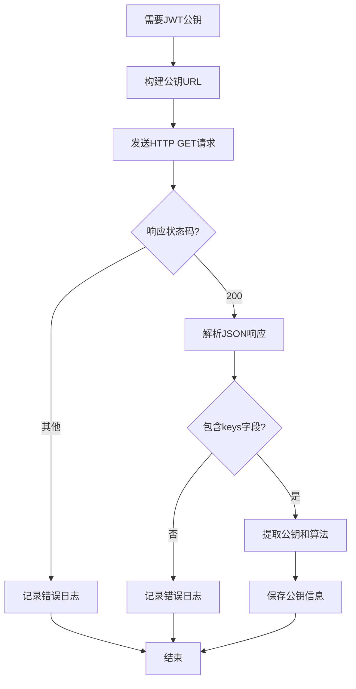
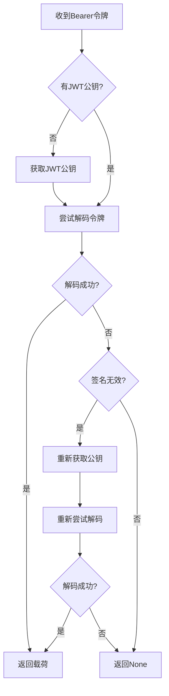
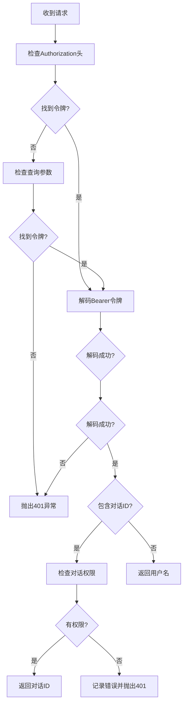

# Rasa Chat Channel 核心功能分析

## 概述

`rasa_chat.py` 是 Rasa 框架中实现 Rasa 企业版聊天输入通道的核心模块。该模块提供了与 Rasa 企业版管理API的集成，支持JWT令牌认证、用户权限验证和安全的对话管理功能，是企业级Rasa部署的重要组成部分。

## 核心架构

### 1. 类定义和继承关系

#### RasaChatInput 类
```python
class RasaChatInput(RestInput):
    """Rasa企业版的聊天输入通道。"""
```

**继承关系：**
- 继承自 `RestInput` 基类
- 实现企业级认证和权限管理
- 支持JWT令牌验证

### 2. 常量定义

```python
# 对话ID键名常量
CONVERSATION_ID_KEY = "conversation_id"
# JWT用户名键名常量
JWT_USERNAME_KEY = "username"
# 交互式学习权限常量
INTERACTIVE_LEARNING_PERMISSION = "clientEvents:create"
```

**常量说明：**
- `CONVERSATION_ID_KEY`: 用于标识对话ID的键名
- `JWT_USERNAME_KEY`: JWT载荷中用户名字段的键名
- `INTERACTIVE_LEARNING_PERMISSION`: 交互式学习所需的权限

## 核心功能实现

### 1. 通道管理

#### 通道名称和创建
```python
@classmethod
def name(cls) -> Text:
    """返回通道名称。"""
    return "rasa"

@classmethod
def from_credentials(cls, credentials: Optional[Dict[Text, Any]]) -> InputChannel:
    """从凭据创建输入通道。"""
    if not credentials:
        cls.raise_missing_credentials_exception()
    return cls(credentials.get("url"))
```

**功能特点：**
- 通道名称为 "rasa"
- 支持从凭据字典创建通道实例
- 自动验证凭据完整性

#### 通道初始化
```python
def __init__(self, url: Optional[Text]) -> None:
    """使用属性初始化通道。"""
    self.base_url = url                    # 基础URL
    self.jwt_key: Optional[Text] = None    # JWT公钥
    self.jwt_algorithm = None              # JWT算法
```

**初始化属性：**
- `base_url`: Rasa企业版的基础URL
- `jwt_key`: 用于验证JWT令牌的公钥
- `jwt_algorithm`: JWT签名算法

### 2. JWT公钥管理

#### 公钥获取机制
```python
async def _fetch_public_key(self) -> None:
    """从Rasa企业版获取JWT公钥。"""
    public_key_url = f"{self.base_url}/version"
    async with aiohttp.ClientSession() as session:
        async with session.get(
            public_key_url, timeout=DEFAULT_REQUEST_TIMEOUT
        ) as resp:
            status_code = resp.status
            if status_code != 200:
                logger.error("Failed to fetch JWT public key...")
                return
            rjs = await resp.json()
            if "keys" in rjs:
                self.jwt_key = rjs["keys"][0]["key"]
                self.jwt_algorithm = rjs["keys"][0]["alg"]
            else:
                logger.error("Could not find JWT public key...")
```

**实现特点：**
- 从 `/version` 端点获取公钥
- 支持超时控制
- 完善的错误处理
- 自动解析公钥和算法

**错误处理：**
- HTTP状态码检查
- JSON响应验证
- 详细的错误日志记录

### 3. JWT令牌解码

#### 令牌解码机制
```python
async def _decode_bearer_token(self, bearer_token: Text) -> Optional[Dict]:
    """解码Bearer令牌。"""
    if self.jwt_key is None:
        await self._fetch_public_key()

    try:
        return rasa.core.channels.channel.decode_jwt(
            bearer_token, self.jwt_key, self.jwt_algorithm
        )
    except jwt.InvalidSignatureError:
        logger.error("JWT public key invalid, fetching new one.")
        await self._fetch_public_key()
        return rasa.core.channels.channel.decode_jwt(
            bearer_token, self.jwt_key, self.jwt_algorithm
        )
```

**解码流程：**
1. 检查是否有JWT公钥，没有则先获取
2. 尝试解码JWT令牌
3. 如果签名无效，重新获取公钥并重试
4. 返回解码后的载荷或None

**容错机制：**
- 自动获取公钥
- 签名验证失败时重新获取公钥
- 异常处理和日志记录

### 4. 用户身份验证

#### 发送者提取机制
```python
async def _extract_sender(self, req: Request) -> Optional[Text]:
    """从Rasa企业版管理API获取用户。"""
    jwt_payload = None
    # 首先尝试从Authorization头获取JWT令牌
    if req.headers.get("Authorization"):
        jwt_payload = await self._decode_bearer_token(req.headers["Authorization"])

    # 如果从头部没有获取到，尝试从查询参数获取
    if not jwt_payload:
        jwt_payload = await self._decode_bearer_token(req.args.get("token"))

    # 如果仍然没有获取到JWT载荷，抛出401未授权异常
    if not jwt_payload:
        raise SanicException(status_code=401)

    # 如果请求中包含对话ID
    if CONVERSATION_ID_KEY in req.json:
        # 检查用户是否有权限向该对话发送消息
        if self._has_user_permission_to_send_messages_to_conversation(
            jwt_payload, req.json
        ):
            return req.json[CONVERSATION_ID_KEY]
        else:
            logger.error("User does not have permissions...")
            raise SanicException(status_code=401)

    # 返回JWT载荷中的用户名作为发送者
    return jwt_payload[JWT_USERNAME_KEY]
```

**认证流程：**
1. 尝试从Authorization头获取JWT令牌
2. 如果失败，尝试从查询参数获取
3. 解码JWT令牌获取载荷
4. 检查对话权限（如果适用）
5. 返回发送者ID

**权限验证：**
- 支持多种令牌获取方式
- 对话级别的权限检查
- 详细的错误日志记录

### 5. 权限管理

#### 对话权限检查
```python
@staticmethod
def _has_user_permission_to_send_messages_to_conversation(
    jwt_payload: Dict, message: Dict
) -> bool:
    """检查用户是否有权限向指定对话发送消息。"""
    user_scopes = jwt_payload.get("scopes", [])
    return INTERACTIVE_LEARNING_PERMISSION in user_scopes or message[
        CONVERSATION_ID_KEY
    ] == jwt_payload.get(JWT_USERNAME_KEY)
```

**权限规则：**
1. 用户具有交互式学习权限（`clientEvents:create`）
2. 或者对话ID与用户名相同（用户自己的对话）

**权限模型：**
- 基于JWT作用域的权限控制
- 支持用户级别的对话访问
- 细粒度的权限管理

## 核心功能流程

### 1. JWT公钥获取流程



### 2. JWT令牌解码流程



### 3. 用户身份验证流程



## 安全机制

### 1. JWT令牌验证
- 使用RSA公钥验证JWT签名
- 支持多种签名算法
- 自动公钥轮换机制

### 2. 权限控制
- 基于作用域的权限模型
- 对话级别的访问控制
- 细粒度的权限管理

### 3. 错误处理
- 详细的错误日志记录
- 适当的HTTP状态码返回
- 安全的错误信息暴露

## 配置管理

### 1. 凭据配置
```python
credentials = {
    "url": "https://your-rasa-enterprise.com"
}
```

### 2. 环境变量
- 支持通过环境变量配置超时时间
- 可配置的请求超时设置

### 3. 错误处理配置
- 可配置的日志级别
- 详细的错误信息记录

## 使用示例

### 1. 基本配置
```python
# 创建Rasa Chat输入通道
channel = RasaChatInput.from_credentials({
    "url": "https://your-rasa-enterprise.com"
})
```

### 2. 认证流程
```python
# 用户发送请求时，通道会：
# 1. 从Authorization头或查询参数获取JWT令牌
# 2. 从Rasa企业版获取公钥（如果需要）
# 3. 验证JWT令牌签名
# 4. 检查用户权限
# 5. 返回发送者ID
```

### 3. 权限检查
```python
# 权限检查规则：
# 1. 用户具有 clientEvents:create 权限
# 2. 或者对话ID与用户名相同
```

## 错误处理机制

### 1. HTTP错误处理
```python
if status_code != 200:
    logger.error("Failed to fetch JWT public key...")
    return
```

### 2. JWT错误处理
```python
except jwt.InvalidSignatureError:
    logger.error("JWT public key invalid, fetching new one.")
    await self._fetch_public_key()
```

### 3. 权限错误处理
```python
if not jwt_payload:
    raise SanicException(status_code=401)
```

## 性能优化

### 1. 公钥缓存
- JWT公钥在内存中缓存
- 避免重复获取公钥
- 支持公钥轮换

### 2. 异步处理
- 使用aiohttp进行异步HTTP请求
- 非阻塞的JWT解码
- 高效的错误处理

### 3. 超时控制
- 可配置的请求超时
- 防止长时间等待
- 提高系统响应性

## 扩展性设计

### 1. 算法支持
- 支持多种JWT签名算法
- 可扩展的算法支持
- 自动算法检测

### 2. 权限模型
- 可扩展的权限检查
- 支持自定义权限规则
- 灵活的权限管理

### 3. 错误处理
- 可配置的错误处理
- 支持自定义错误响应
- 详细的日志记录

## 总结

`rasa_chat.py` 模块实现了一个安全、可靠的企业级聊天输入通道，具有以下核心特点：

### 优势
1. **企业级安全**: 完整的JWT令牌验证和权限管理
2. **高可用性**: 自动公钥轮换和错误恢复机制
3. **灵活配置**: 支持多种配置选项和环境变量
4. **详细日志**: 完善的日志记录和错误跟踪
5. **异步支持**: 高效的异步处理机制

### 应用场景
1. **企业级部署**: 大型企业的Rasa部署
2. **多租户系统**: 支持多用户的对话系统
3. **安全要求高的场景**: 需要严格权限控制的场景
4. **集成现有系统**: 与现有企业系统集成

### 设计理念
该模块体现了Rasa企业版在安全性方面的设计理念：
- **安全性**: 完整的JWT验证和权限控制
- **可靠性**: 自动错误恢复和公钥轮换
- **可扩展性**: 灵活的权限模型和配置选项
- **可维护性**: 详细的日志记录和错误处理

这种设计使得Rasa企业版能够在企业环境中提供安全、可靠的对话服务，满足企业级应用的安全和合规要求。
