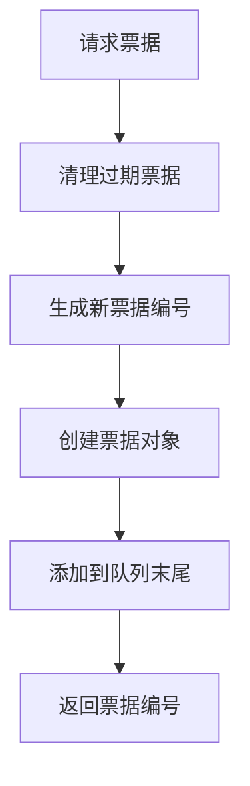
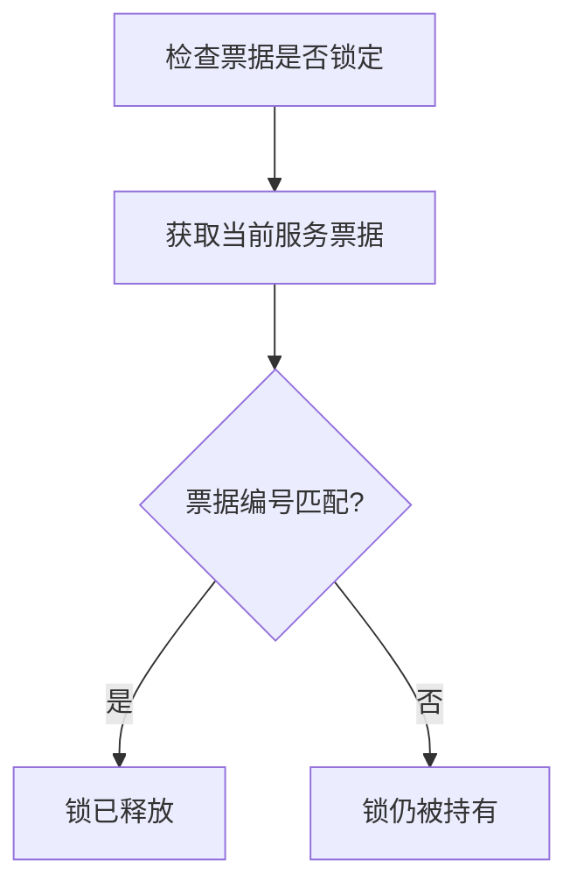
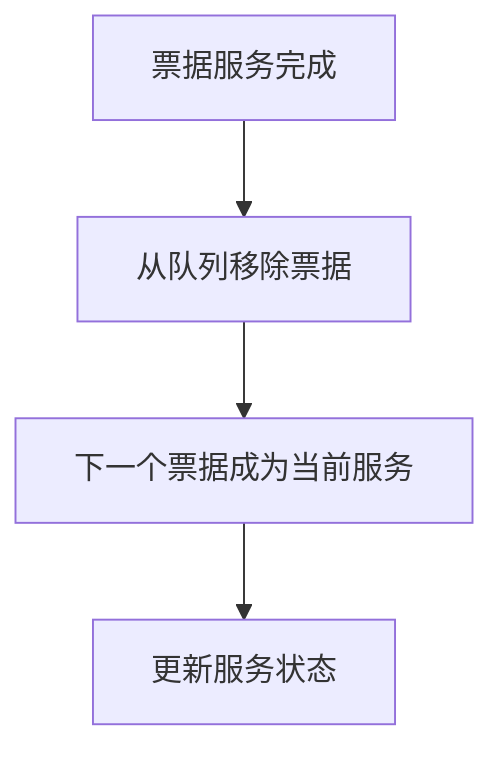

# Rasa Lock 核心功能分析

## 概述

`lock.py` 是 Rasa 框架中实现票据锁机制的核心模块。该模块通过发行票据来管理对对话ID的并发访问，确保在分布式环境中对话状态的一致性和线程安全。票据锁算法基于经典的"面包店算法"（Bakery Algorithm），提供了公平的排队机制。

## 核心架构

### 1. Ticket 类 - 票据实体

```python
class Ticket:
    """票据类，表示一个访问对话ID的票据。"""
```

**核心属性：**
- `number`: 票据编号（整数）
- `expires`: 票据过期时间（时间戳）

**关键方法：**

#### 1.1 票据生命周期管理
```python
def has_expired(self) -> bool:
    """检查票据是否已过期。"""
    return time.time() > self.expires
```

#### 1.2 序列化支持
```python
def as_dict(self) -> Dict[Text, Any]:
    """将票据转换为字典格式。"""
    return dict(number=self.number, expires=self.expires)

def dumps(self) -> Text:
    """返回票据字典的JSON字符串。"""
    return json.dumps(self.as_dict())

@classmethod
def from_dict(cls, data: Dict[Text, Union[int, float]]) -> "Ticket":
    """从字典创建票据。"""
    return cls(number=data["number"], expires=data["expires"])
```

### 2. TicketLock 类 - 票据锁管理器

```python
class TicketLock:
    """票据锁机制，通过发行票据来管理对对话ID的访问。"""
```

**核心属性：**
- `conversation_id`: 对话ID
- `tickets`: 票据队列（双端队列）

## 核心算法实现

### 1. 票据发行机制

```python
def issue_ticket(self, lifetime: float) -> int:
    """发行新票据并返回其编号。"""
    # 先移除过期的票据
    self.remove_expired_tickets()
    # 生成新的票据编号（比最后发行的票据编号大1）
    number = self.last_issued + 1
    # 创建新票据，过期时间为当前时间加上生存时间
    ticket = Ticket(number, time.time() + lifetime)
    # 将新票据添加到队列末尾
    self.tickets.append(ticket)
    return number
```

**算法特点：**
- **顺序编号**: 票据按请求顺序递增编号
- **自动过期**: 票据具有生存时间，自动清理过期票据
- **FIFO队列**: 使用双端队列保证先进先出

### 2. 锁状态检查

```python
def is_locked(self, ticket_number: int) -> bool:
    """检查指定票据编号是否被锁定。"""
    return self.now_serving != ticket_number
```

**锁定逻辑：**
- 只有当前服务的票据编号等于请求的票据编号时，锁才被释放
- 其他所有票据都处于等待状态（被锁定）

### 3. 服务状态管理

```python
@property
def now_serving(self) -> Optional[int]:
    """获取下一个要服务的票据编号。"""
    return self._ticket_number_for(0) or 0

@property
def last_issued(self) -> int:
    """返回最后添加的票据编号。"""
    ticket_number = self._ticket_number_for(-1)
    return ticket_number if ticket_number is not None else NO_TICKET_ISSUED
```

**服务机制：**
- `now_serving`: 队列中第一个票据（即将被服务）
- `last_issued`: 队列中最后一个票据（最新发行）

### 4. 过期票据清理

```python
def remove_expired_tickets(self) -> None:
    """移除过期的票据。"""
    # 遍历票据列表的副本，这样可以在遍历时安全地移除元素
    for ticket in list(self.tickets):
        if ticket.has_expired():
            self.tickets.remove(ticket)
```

**清理策略：**
- 在每次操作前自动清理过期票据
- 使用列表副本避免遍历时修改集合的问题
- 确保队列中只保留有效票据

## 算法流程图

### 1. 票据获取流程



### 2. 锁检查流程



### 3. 票据服务流程



## 核心设计模式

### 1. 队列模式（Queue Pattern）
```python
from collections import deque

class TicketLock:
    def __init__(self, conversation_id: Text, tickets: Optional[Deque[Ticket]] = None):
        self.tickets = tickets or deque()
```

**优势：**
- 保证FIFO（先进先出）顺序
- 高效的队首和队尾操作
- 支持双端操作

### 2. 状态模式（State Pattern）
```python
def is_locked(self, ticket_number: int) -> bool:
    """根据当前服务状态判断票据是否被锁定"""
    return self.now_serving != ticket_number
```

### 3. 工厂模式（Factory Pattern）
```python
@classmethod
def from_dict(cls, data: Dict[Text, Any]) -> "TicketLock":
    """从字典创建票据锁实例"""
    tickets = [Ticket.from_dict(json.loads(d)) for d in data.get("tickets", [])]
    return cls(data.get("conversation_id"), deque(tickets))
```

## 并发安全机制

### 1. 原子操作设计
- 票据编号生成是原子操作
- 队列操作使用线程安全的数据结构
- 状态检查基于单一比较操作

### 2. 过期机制
```python
def has_expired(self) -> bool:
    """基于时间戳的过期检查"""
    return time.time() > self.expires
```

**优势：**
- 自动清理过期票据，防止内存泄漏
- 避免僵尸票据阻塞队列
- 基于系统时间，精度高

### 3. 异常处理
```python
def _ticket_number_for(self, ticket_index: int) -> Optional[int]:
    try:
        return self.tickets[ticket_index].number
    except IndexError:
        return None
```

## 性能优化

### 1. 延迟清理策略
- 只在需要时清理过期票据
- 避免频繁的全队列扫描
- 在关键操作前进行清理

### 2. 内存管理
```python
def remove_expired_tickets(self) -> None:
    """使用列表副本避免并发修改异常"""
    for ticket in list(self.tickets):
        if ticket.has_expired():
            self.tickets.remove(ticket)
```

### 3. 高效查找
```python
def _ticket_for_ticket_number(self, ticket_number: int) -> Optional[Ticket]:
    """使用生成器表达式进行高效查找"""
    return next((t for t in self.tickets if t.number == ticket_number), None)
```

## 序列化支持

### 1. JSON序列化
```python
def dumps(self) -> Text:
    """将票据锁序列化为JSON字符串"""
    tickets = [ticket.dumps() for ticket in self.tickets]
    return json.dumps(dict(conversation_id=self.conversation_id, tickets=tickets))
```

### 2. 反序列化
```python
@classmethod
def from_dict(cls, data: Dict[Text, Any]) -> "TicketLock":
    """从字典数据重建票据锁"""
    tickets = [Ticket.from_dict(json.loads(d)) for d in data.get("tickets", [])]
    return cls(data.get("conversation_id"), deque(tickets))
```

**应用场景：**
- 分布式环境下的状态同步
- 持久化存储
- 网络传输

## 使用示例

### 1. 基本使用
```python
# 创建票据锁
lock = TicketLock(conversation_id="user123")

# 请求票据
ticket_number = lock.issue_ticket(lifetime=30.0)  # 30秒生存时间

# 检查是否被锁定
if lock.is_locked(ticket_number):
    print("等待中...")
else:
    print("可以访问对话")

# 完成操作后释放票据
lock.remove_ticket_for(ticket_number)
```

### 2. 并发控制
```python
import asyncio

async def process_conversation(conversation_id: str):
    lock = TicketLock(conversation_id)
    
    # 获取票据
    ticket = lock.issue_ticket(lifetime=60.0)
    
    # 等待锁释放
    while lock.is_locked(ticket):
        await asyncio.sleep(0.1)
    
    try:
        # 执行对话处理逻辑
        await process_dialogue(conversation_id)
    finally:
        # 释放票据
        lock.remove_ticket_for(ticket)
```

### 3. 状态监控
```python
def monitor_lock_status(lock: TicketLock):
    """监控锁状态"""
    print(f"当前服务票据: {lock.now_serving}")
    print(f"最后发行票据: {lock.last_issued}")
    print(f"等待队列长度: {len(lock.tickets)}")
    print(f"是否有人在等待: {lock.is_someone_waiting()}")
```

## 算法复杂度分析

### 1. 时间复杂度
- **票据发行**: O(1) - 队列末尾添加
- **锁检查**: O(1) - 单一比较操作
- **票据清理**: O(n) - 遍历所有票据
- **票据查找**: O(n) - 线性搜索

### 2. 空间复杂度
- **存储空间**: O(n) - n为活跃票据数量
- **临时空间**: O(1) - 常量额外空间

### 3. 优化建议
- 对于高并发场景，可考虑使用哈希表优化票据查找
- 实现票据编号的跳跃表结构
- 使用定时器定期清理过期票据

## 错误处理机制

### 1. 边界条件处理
```python
@property
def last_issued(self) -> int:
    ticket_number = self._ticket_number_for(-1)
    return ticket_number if ticket_number is not None else NO_TICKET_ISSUED
```

### 2. 异常安全
```python
def _ticket_number_for(self, ticket_index: int) -> Optional[int]:
    try:
        return self.tickets[ticket_index].number
    except IndexError:
        return None
```

### 3. 数据一致性
- 所有操作前都进行过期票据清理
- 使用不可变数据结构避免并发修改
- 原子操作保证状态一致性

## 总结

`lock.py` 模块实现了一个高效、公平的票据锁机制，具有以下核心特点：

### 优势
1. **公平性**: 基于FIFO队列，确保先到先服务
2. **自动清理**: 过期票据自动清理，防止内存泄漏
3. **并发安全**: 基于原子操作，支持多线程环境
4. **可序列化**: 支持JSON序列化，便于分布式部署
5. **简单高效**: 算法简单，性能优秀

### 应用场景
1. **对话状态管理**: 确保同一对话的并发访问安全
2. **资源锁定**: 管理共享资源的访问权限
3. **分布式协调**: 在分布式环境中实现互斥访问
4. **任务队列**: 实现公平的任务调度机制

### 设计理念
该模块体现了Rasa框架在并发控制方面的设计理念：
- **简单性**: 算法简单易懂，易于维护
- **可靠性**: 通过过期机制和异常处理保证系统稳定
- **可扩展性**: 支持序列化，便于分布式部署
- **性能**: 高效的队列操作和状态检查

这种设计使得Rasa能够在高并发环境下安全地管理对话状态，为构建可靠的对话系统提供了坚实的基础。
