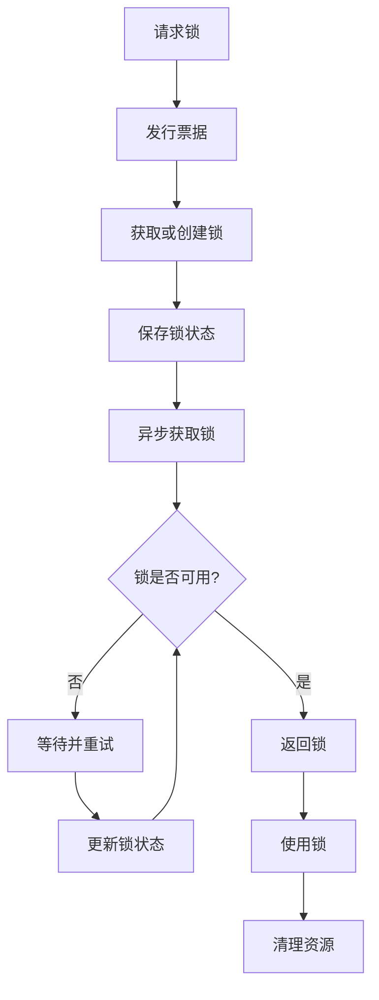
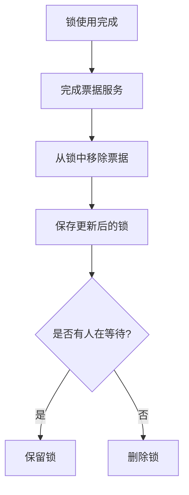
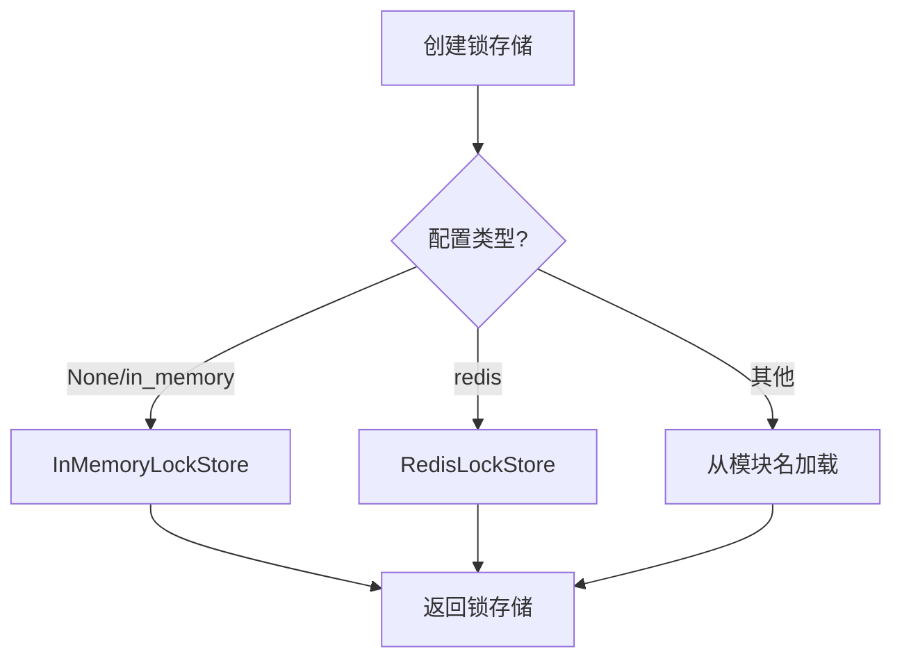

# Rasa Lock Store 核心功能分析

## 概述

`lock_store.py` 是 Rasa 框架中实现锁存储管理的核心模块。该模块提供了票据锁的持久化存储机制，支持内存和Redis两种存储后端，为分布式环境下的对话状态管理提供了可靠的并发控制基础。

## 核心架构

### 1. 基础抽象类

#### LockStore 基类
```python
class LockStore:
    """票据锁的基类。"""
```

**核心功能：**
- 定义锁存储的统一接口
- 提供票据发行和锁获取的通用逻辑
- 实现异步上下文管理器支持

**关键方法：**
- `issue_ticket()`: 发行票据
- `lock()`: 异步上下文管理器获取锁
- `get_lock()`: 获取锁（抽象方法）
- `save_lock()`: 保存锁（抽象方法）
- `delete_lock()`: 删除锁（抽象方法）

### 2. 异常处理

#### LockError 异常类
```python
class LockError(RasaException):
    """当无法获取锁时抛出的异常。"""
```

**用途：**
- 处理锁获取失败的情况
- 提供详细的错误信息
- 继承自RasaException，保持异常体系一致性

### 3. 配置管理

#### 环境变量配置
```python
def _get_lock_lifetime() -> int:
    """获取锁的生存时间。"""
    return int(os.environ.get("TICKET_LOCK_LIFETIME", 0)) or DEFAULT_LOCK_LIFETIME

# 锁的生存时间（秒）
LOCK_LIFETIME = _get_lock_lifetime()
# 默认套接字超时时间（秒）
DEFAULT_SOCKET_TIMEOUT_IN_SECONDS = 10
# Redis锁存储的默认键前缀
DEFAULT_REDIS_LOCK_STORE_KEY_PREFIX = "lock:"
```

## 核心功能实现

### 1. 票据发行机制

```python
def issue_ticket(
    self, conversation_id: Text, lock_lifetime: float = LOCK_LIFETIME
) -> int:
    """为与`conversation_id`关联的锁发行具有`lock_lifetime`的新票据。"""
    logger.debug(f"Issuing ticket for conversation '{conversation_id}'.")
    try:
        # 获取或创建锁
        lock = self.get_or_create_lock(conversation_id)
        # 发行票据
        ticket = lock.issue_ticket(lock_lifetime)
        # 保存锁状态
        self.save_lock(lock)
        return ticket
    except Exception as e:
        # 抛出锁错误
        raise LockError(f"Error while acquiring lock. Error:\n{e}")
```

**流程特点：**
- 自动获取或创建锁
- 发行票据并保存状态
- 异常处理和错误传播

### 2. 异步锁获取机制

```python
@asynccontextmanager
async def lock(
    self,
    conversation_id: Text,
    lock_lifetime: float = LOCK_LIFETIME,
    wait_time_in_seconds: float = 1,
) -> AsyncGenerator[TicketLock, None]:
    """为`conversation_id`获取具有生存时间`lock_lifetime`的锁。"""
    # 发行票据
    ticket = self.issue_ticket(conversation_id, lock_lifetime)
    try:
        # 异步获取锁并返回
        yield await self._acquire_lock(
            conversation_id, ticket, wait_time_in_seconds
        )
    finally:
        # 清理资源
        self.cleanup(conversation_id, ticket)
```

**设计特点：**
- 使用异步上下文管理器
- 自动资源清理
- 支持重试机制

### 3. 锁获取核心算法

```python
async def _acquire_lock(
    self, conversation_id: Text, ticket: int, wait_time_in_seconds: float
) -> TicketLock:
    """异步获取锁。"""
    logger.debug(f"Acquiring lock for conversation '{conversation_id}'.")
    while True:
        # 每次迭代都获取锁，因为锁可能不再存在
        lock = self.get_lock(conversation_id)

        # 如果锁不再存在（已过期），退出循环
        if not lock:
            break

        # 如果锁未被锁定，则获取锁
        if not lock.is_locked(ticket):
            logger.debug(f"Acquired lock for conversation '{conversation_id}'.")
            return lock

        # 计算在此票据之前有多少个票据
        items_before_this = ticket - (lock.now_serving or 0)

        logger.debug(
            f"Failed to acquire lock for conversation ID '{conversation_id}' "
            f"because {items_before_this} other item(s) for this "
            f"conversation ID have to be finished processing first. "
            f"Retrying in {wait_time_in_seconds} seconds ..."
        )

        # 休眠并更新锁
        await asyncio.sleep(wait_time_in_seconds)
        self.update_lock(conversation_id)

    # 如果无法获取锁，抛出异常
    raise LockError(
        f"Could not acquire lock for conversation_id '{conversation_id}'."
    )
```

**算法特点：**
- 轮询机制等待锁释放
- 动态更新锁状态
- 详细的等待信息记录
- 超时处理

## 具体存储实现

### 1. InMemoryLockStore（内存存储）

```python
class InMemoryLockStore(LockStore):
    """票据锁的内存存储。"""

    def __init__(self) -> None:
        """初始化锁字典。"""
        # 创建对话锁字典
        self.conversation_locks: Dict[Text, TicketLock] = {}
        super().__init__()
```

**特点：**
- 最简单的存储方式
- 数据存储在内存字典中
- 适合单机环境
- 服务重启后数据丢失

**实现方法：**
```python
def get_lock(self, conversation_id: Text) -> Optional[TicketLock]:
    """如果存在则获取对话的锁。"""
    return self.conversation_locks.get(conversation_id)

def save_lock(self, lock: TicketLock) -> None:
    """在存储中保存锁。"""
    self.conversation_locks[lock.conversation_id] = lock

def delete_lock(self, conversation_id: Text) -> None:
    """删除对话的锁。"""
    deleted_lock = self.conversation_locks.pop(conversation_id, None)
    self._log_deletion(
        conversation_id, deletion_successful=deleted_lock is not None
    )
```

### 2. RedisLockStore（Redis存储）

```python
class RedisLockStore(LockStore):
    """票据锁的Redis存储。"""

    def __init__(
        self,
        host: Text = "localhost",
        port: int = 6379,
        db: int = 1,
        username: Optional[Text] = None,
        password: Optional[Text] = None,
        use_ssl: bool = False,
        ssl_certfile: Optional[Text] = None,
        ssl_keyfile: Optional[Text] = None,
        ssl_ca_certs: Optional[Text] = None,
        key_prefix: Optional[Text] = None,
        socket_timeout: float = DEFAULT_SOCKET_TIMEOUT_IN_SECONDS,
    ) -> None:
        """创建使用Redis进行持久化的锁存储。"""
        import redis

        # 创建Redis连接
        self.red = redis.StrictRedis(
            host=host,
            port=int(port),
            db=int(db),
            username=username,
            password=password,
            ssl=use_ssl,
            ssl_certfile=ssl_certfile,
            ssl_keyfile=ssl_keyfile,
            ssl_ca_certs=ssl_ca_certs,
            socket_timeout=socket_timeout,
        )

        # 设置键前缀
        self.key_prefix = DEFAULT_REDIS_LOCK_STORE_KEY_PREFIX
        if key_prefix:
            logger.debug(f"Setting non-default redis key prefix: '{key_prefix}'.")
            self._set_key_prefix(key_prefix)

        super().__init__()
```

**特点：**
- 高性能键值存储
- 支持数据持久化
- 支持集群部署
- 适合生产环境

**实现方法：**
```python
def get_lock(self, conversation_id: Text) -> Optional[TicketLock]:
    """检索锁。"""
    # 从Redis获取序列化的锁
    serialised_lock = self.red.get(self.key_prefix + conversation_id)
    if serialised_lock:
        # 反序列化为票据锁对象
        return TicketLock.from_dict(json.loads(serialised_lock))
    return None

def save_lock(self, lock: TicketLock) -> None:
    """保存锁到Redis。"""
    # 将锁序列化并保存到Redis
    self.red.set(self.key_prefix + lock.conversation_id, lock.dumps())

def delete_lock(self, conversation_id: Text) -> None:
    """删除对话ID的锁。"""
    # 从Redis删除锁
    deletion_successful = self.red.delete(self.key_prefix + conversation_id)
    # 记录删除操作
    self._log_deletion(conversation_id, deletion_successful)
```

## 核心功能流程

### 1. 锁获取流程



### 2. 锁清理流程



### 3. 存储选择流程



## 设计模式

### 1. 工厂模式
```python
@staticmethod
def create(obj: Union[LockStore, EndpointConfig, None]) -> LockStore:
    """创建锁存储的工厂方法。"""
    if isinstance(obj, LockStore):
        return obj
    try:
        return _create_from_endpoint_config(obj)
    except ConnectionError as error:
        raise ConnectionException("Cannot connect to lock store.") from error
```

### 2. 策略模式
不同的存储实现类实现了相同的接口，可以根据配置选择不同的存储策略。

### 3. 模板方法模式
基类定义了锁获取的通用流程，子类实现具体的存储细节。

### 4. 上下文管理器模式
```python
@asynccontextmanager
async def lock(self, conversation_id: Text, ...) -> AsyncGenerator[TicketLock, None]:
    """异步上下文管理器获取锁。"""
    ticket = self.issue_ticket(conversation_id, lock_lifetime)
    try:
        yield await self._acquire_lock(conversation_id, ticket, wait_time_in_seconds)
    finally:
        self.cleanup(conversation_id, ticket)
```

## 并发安全机制

### 1. 异步支持
- 使用`asyncio`进行异步操作
- 支持异步上下文管理器
- 非阻塞的锁获取机制

### 2. 重试机制
```python
# 休眠并更新锁
await asyncio.sleep(wait_time_in_seconds)
self.update_lock(conversation_id)
```

### 3. 自动清理
```python
def cleanup(self, conversation_id: Text, ticket_number: int) -> None:
    """如果没有人等待，则移除`conversation_id`的锁。"""
    # 完成票据服务
    self.finish_serving(conversation_id, ticket_number)
    # 如果没有人在等待，删除锁
    if not self.is_someone_waiting(conversation_id):
        self.delete_lock(conversation_id)
```

## 性能优化

### 1. 连接池管理
Redis存储支持连接池，提高并发性能。

### 2. 序列化优化
使用JSON序列化，平衡性能和可读性。

### 3. 键前缀管理
```python
def _set_key_prefix(self, key_prefix: Text) -> None:
    """设置键前缀。"""
    if isinstance(key_prefix, str) and key_prefix.isalnum():
        self.key_prefix = key_prefix + ":" + DEFAULT_REDIS_LOCK_STORE_KEY_PREFIX
    else:
        logger.warning(
            f"Omitting provided non-alphanumeric redis key prefix: '{key_prefix}'. "
            f"Using default '{self.key_prefix}' instead."
        )
```

### 4. 超时处理
```python
socket_timeout: float = DEFAULT_SOCKET_TIMEOUT_IN_SECONDS
```

## 错误处理机制

### 1. 连接异常处理
```python
try:
    return _create_from_endpoint_config(obj)
except ConnectionError as error:
    raise ConnectionException("Cannot connect to lock store.") from error
```

### 2. 锁获取异常
```python
try:
    lock = self.get_or_create_lock(conversation_id)
    ticket = lock.issue_ticket(lock_lifetime)
    self.save_lock(lock)
    return ticket
except Exception as e:
    raise LockError(f"Error while acquiring lock. Error:\n{e}")
```

### 3. 模块加载异常
```python
try:
    lock_store_class = rasa.shared.utils.common.class_from_module_path(
        endpoint_config.type
    )
    return lock_store_class(endpoint_config=endpoint_config)
except (AttributeError, ImportError) as e:
    raise Exception(
        f"Could not find a class based on the module path "
        f"'{endpoint_config.type}'. Failed to create a `LockStore` "
        f"instance. Error: {e}"
    )
```

## 使用示例

### 1. 基本使用
```python
# 创建内存锁存储
lock_store = InMemoryLockStore()

# 使用异步上下文管理器获取锁
async with lock_store.lock("user123") as lock:
    # 执行需要锁保护的操作
    await process_conversation("user123")
```

### 2. Redis存储配置
```python
# 通过端点配置创建Redis存储
endpoint_config = EndpointConfig(
    type="redis",
    url="localhost:6379",
    kwargs={"db": 1, "password": "your_password"}
)
lock_store = LockStore.create(endpoint_config)
```

### 3. 自定义锁生存时间
```python
# 使用自定义锁生存时间
async with lock_store.lock("user123", lock_lifetime=60.0) as lock:
    # 锁将在60秒后过期
    await long_running_operation()
```

### 4. 手动票据管理
```python
# 手动发行票据
ticket = lock_store.issue_ticket("user123", lock_lifetime=30.0)

# 检查是否有人在等待
if lock_store.is_someone_waiting("user123"):
    print("有人正在等待锁")

# 完成服务
lock_store.finish_serving("user123", ticket)
```

## 配置管理

### 1. 环境变量
```bash
# 设置锁生存时间
export TICKET_LOCK_LIFETIME=60

# 设置Redis连接参数
export REDIS_HOST=localhost
export REDIS_PORT=6379
export REDIS_DB=1
```

### 2. 端点配置
```yaml
# endpoints.yml
lock_store:
  type: redis
  url: localhost:6379
  db: 1
  password: your_password
  key_prefix: "myapp"
```

### 3. 程序化配置
```python
# 直接创建Redis锁存储
lock_store = RedisLockStore(
    host="localhost",
    port=6379,
    db=1,
    password="your_password",
    key_prefix="myapp"
)
```

## 监控和调试

### 1. 日志记录
```python
logger.debug(f"Issuing ticket for conversation '{conversation_id}'.")
logger.debug(f"Acquiring lock for conversation '{conversation_id}'.")
logger.debug(f"Acquired lock for conversation '{conversation_id}'.")
```

### 2. 状态监控
```python
def monitor_lock_status(lock_store: LockStore, conversation_id: str):
    """监控锁状态"""
    lock = lock_store.get_lock(conversation_id)
    if lock:
        print(f"当前服务票据: {lock.now_serving}")
        print(f"最后发行票据: {lock.last_issued}")
        print(f"等待队列长度: {len(lock.tickets)}")
        print(f"是否有人在等待: {lock.is_someone_waiting()}")
    else:
        print("锁不存在")
```

## 算法复杂度分析

### 1. 时间复杂度
- **票据发行**: O(1) - 常量时间操作
- **锁获取**: O(n) - n为等待队列长度
- **锁保存**: O(1) - 常量时间操作
- **锁删除**: O(1) - 常量时间操作

### 2. 空间复杂度
- **内存存储**: O(n) - n为活跃锁数量
- **Redis存储**: O(n) - n为活跃锁数量

### 3. 网络开销
- **Redis操作**: 每次锁操作需要网络往返
- **序列化开销**: JSON序列化/反序列化

## 总结

`lock_store.py` 模块实现了一个高效、可靠的锁存储管理系统，具有以下核心特点：

### 优势
1. **多存储后端**: 支持内存和Redis存储
2. **异步支持**: 全面的异步操作支持
3. **自动清理**: 智能的资源管理
4. **可配置性**: 灵活的配置选项
5. **错误处理**: 完善的异常处理机制

### 应用场景
1. **对话状态管理**: 确保同一对话的并发访问安全
2. **分布式协调**: 在分布式环境中实现互斥访问
3. **资源锁定**: 管理共享资源的访问权限
4. **任务队列**: 实现公平的任务调度机制

### 设计理念
该模块体现了Rasa框架在并发控制方面的设计理念：
- **简单性**: 清晰的接口设计，易于使用
- **可靠性**: 通过重试机制和异常处理保证系统稳定
- **可扩展性**: 支持多种存储后端，便于扩展
- **性能**: 高效的锁获取和释放机制

这种设计使得Rasa能够在高并发环境下安全地管理对话状态，为构建可靠的对话系统提供了坚实的基础。
